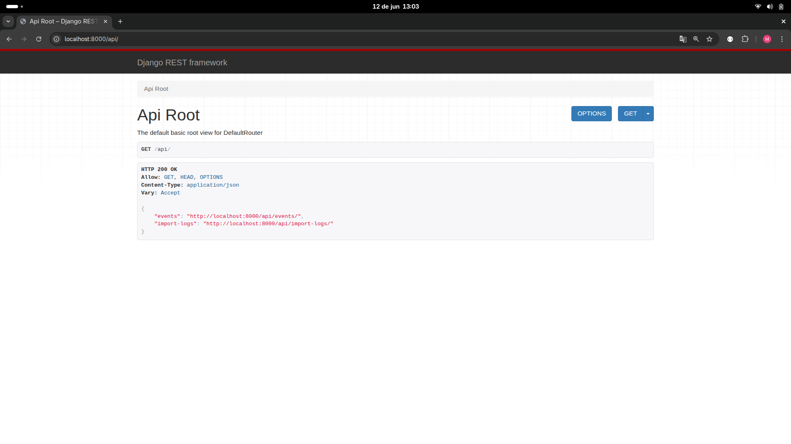
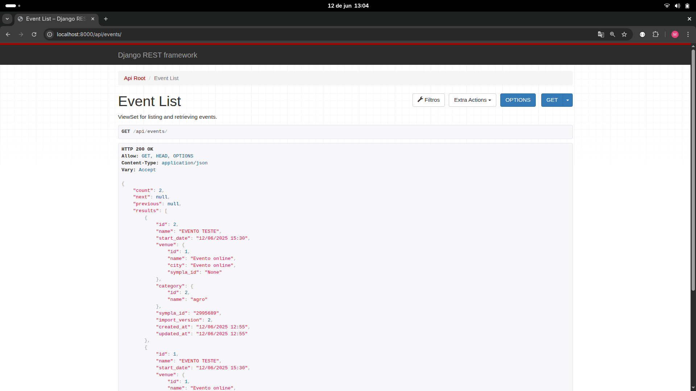
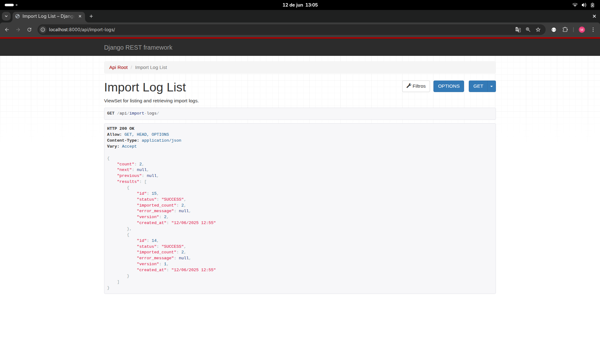

# Sympla Events Integration

Este projeto é uma aplicação Django que integra com a API do Sympla para importar e gerenciar eventos. Ele oferece uma API REST para consulta dos eventos importados e mantém um histórico de importações.

## 📸 Screenshots

### Dashboard de Eventos


### Detalhes do Evento


### Logs de Importação


## 🚀 Tecnologias

- Python 3.11
- Django 5.2
- Django REST Framework
- PostgreSQL
- Redis
- Celery
- Docker & Docker Compose

## 🌟 Funcionalidades

- ✅ Integração com a API do Sympla
- ✅ Importação automática de eventos
- ✅ API REST para consulta de eventos
- ✅ Histórico de importações
- ✅ Tratamento de erros e logging
- ✅ Suporte a paginação
- ✅ Containerização com Docker

## 📋 Pré-requisitos

- Docker
- Docker Compose
- Git

## 🛠️ Instalação

1. Clone o repositório:
```bash
git clone [URL_DO_SEU_REPOSITORIO]
cd sympla-events-prod
```

2. Copie o arquivo de exemplo de variáveis de ambiente:
```bash
cp .env.example .env
```

3. Configure as variáveis de ambiente no arquivo `.env`:
```env
# Django settings
DJANGO_SECRET_KEY=sua_chave_secreta_aqui
DJANGO_DEBUG=True
DJANGO_ALLOWED_HOSTS=localhost,127.0.0.1

# Database settings
POSTGRES_NAME=sympla_events
POSTGRES_USER=postgres
POSTGRES_PASSWORD=postgres
POSTGRES_HOST=db
POSTGRES_PORT=5432

# Sympla API settings
SYMPLA_API_KEY=seu_token_da_api_do_sympla
```

4. Inicie os containers:
```bash
docker-compose up -d
```

5. Execute as migrações:
```bash
docker-compose exec web python manage.py migrate
```

6. Importe os eventos do Sympla:
```bash
docker-compose exec web python manage.py import_events
```

## 🌐 Acessando a Aplicação

Após a instalação, você pode acessar:

- API de Eventos: http://localhost:8000/events/
- API de Logs de Importação: http://localhost:8000/import-logs/

## 📝 Estrutura do Projeto

```
sympla-events-prod/
├── events/                    # Aplicação principal
│   ├── management/           # Comandos personalizados
│   ├── migrations/           # Migrações do banco de dados
│   ├── services/            # Serviços de integração
│   ├── models.py            # Modelos do Django
│   ├── serializers.py       # Serializers da API
│   ├── views.py             # Views da API
│   └── urls.py              # URLs da API
├── sympla_events/           # Configurações do projeto
├── docker-compose.yml       # Configuração do Docker Compose
├── Dockerfile              # Configuração do container
└── requirements.txt        # Dependências Python
```

## 🔑 Obtendo Token da API do Sympla

1. Faça login na sua conta do Sympla
2. Acesse o menu "Minha Conta"
3. Navegue até a aba "Integrações"
4. Clique em "Criar chave de acesso"
5. Copie o token gerado e adicione ao seu arquivo `.env`

[Adicione uma screenshot do processo de geração do token aqui]

## 📊 Modelos de Dados

### Event
- `sympla_id`: ID do evento no Sympla
- `name`: Nome do evento
- `start_date`: Data e hora de início
- `venue`: Local do evento (relacionamento)
- `category`: Categoria do evento (relacionamento)
- `raw_data`: Dados brutos do evento
- `import_version`: Versão da importação

### Venue
- `sympla_id`: ID do local no Sympla
- `name`: Nome do local
- `